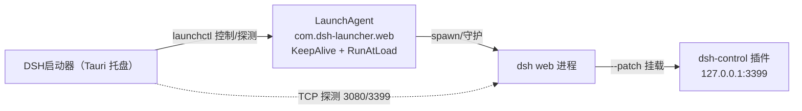

# DSH启动器（dsh-launcher）

dsh（DeepSeek Harness）的系统托盘启动器，让 `dsh --profile web` 常驻并可从菜单栏控制。

## 架构（已决策）

| 决策 | 选择 |
|---|---|
| dsh 进程托管 | **launchd**（LaunchAgent：KeepAlive 崩溃自愈；托盘退出不影响 dsh） |
| UI 形态 | **纯托盘菜单**（无窗口） |
| 控制面插件挂载 | **`--patch` 零侵入**（不改 `~/.dsh/profiles/web`） |
| 开机自启 | **默认关闭**（菜单里手动开关） |
| 托盘启动行为 | **打开托盘即自动拉起 dsh**（若未运行；已运行则跳过） |



## 安装

### 开发运行

```bash
cd src-tauri && cargo run
```

### 正式打包（自包含 .app）

```bash
pnpm tauri build
# .app: src-tauri/target/release/bundle/macos/DSH启动器.app
# dmg:  src-tauri/target/release/bundle/dmg/DSH启动器_<version>_aarch64.dmg
```

拖入 /Applications 即可。注意：dmg 打包依赖 `hdiutil`（系统级磁盘映像操作），在受限沙箱/CI 里会失败；此时用 `pnpm tauri build --bundles app` 只产出 .app。

**插件无需单独安装**：控制面插件已打进 .app 资源（`Contents/Resources/dsh-control/`），托盘启动 dsh 时自动把 `--patch` 写进 LaunchAgent（patch 文件动态生成于 `~/Library/Application Support/dsh-launcher/control.patch.yml`，内容引用实际插件路径），全程零侵入 `~/.dsh/profiles/web`。

## 目录结构

```
DSH启动器（dsh-launcher）/
├── src-tauri/                # Tauri 2 Rust 端
│   ├── src/lib.rs            # 托盘菜单 + launchctl 控制 + 状态轮询 + 打包路径解析
│   ├── src/main.rs
│   ├── tauri.conf.json       # 无窗口配置 + bundle.resources（插件打进 .app）
│   └── icons/                # 全套图标（gen-icon.py 生成源图）
├── src/index.html            # 前端占位（无窗口，永不渲染）
├── plugins/dsh-control/ # dsh 控制面插件（打包为 .app 资源；dev 直接引用源码目录）
│   ├── lib/index.js          # GET /status · POST /shutdown · POST /reload(整树热重载)
│   └── cordis.patch.yml      # dev 模式挂载清单（打包后由运行时动态生成 patch）
└── scripts/gen-icon.py       # 图标源图生成（uv + Pillow）
```

## 待办（后续迭代）

- [ ] 控制面 `/reload` 增强：插件代码变更后的模块级热更新（当前为配置级整树重载，Node ESM 缓存使插件代码变更需冷重启）
- [ ] 托盘图标随状态变色（运行中/已停止）
- [ ] 日志面板（尾随 ~/Library/Logs/dsh-web.log）
- [ ] Windows / Linux 适配（launchctl → sc.exe / systemd）
