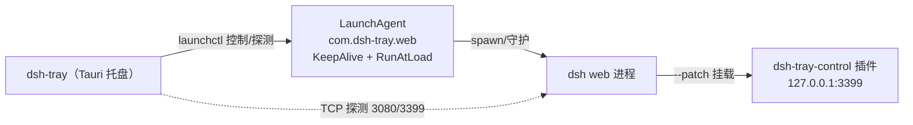

# dsh-tray

dsh（DeepSeek Harness）的系统托盘管理器，让 `dsh --profile web` 常驻并可从菜单栏控制。

## 架构（已决策）

| 决策 | 选择 |
|---|---|
| dsh 进程托管 | **launchd**（LaunchAgent：KeepAlive 崩溃自愈；托盘退出不影响 dsh） |
| UI 形态 | **纯托盘菜单**（无窗口） |
| 控制面插件挂载 | **`--patch` 零侵入**（不改 `~/.dsh/profiles/web`） |
| 开机自启 | **默认关闭**（菜单里手动开关） |



## 目录结构

```
dsh-tray/
├── src-tauri/                # Tauri 2 Rust 端
│   ├── src/lib.rs            # 托盘菜单 + launchctl 控制 + 状态轮询
│   ├── src/main.rs
│   ├── tauri.conf.json       # 无窗口配置
│   └── icons/                # 全套图标（gen-icon.py 生成源图）
├── src/index.html            # 前端占位（无窗口，永不渲染）
├── plugins/dsh-tray-control/ # dsh 控制面插件（--patch 挂载）
│   ├── lib/index.js          # GET /status · POST /shutdown · POST /reload(占位)
│   └── cordis.patch.yml      # 挂载清单（绝对路径）
└── scripts/gen-icon.py       # 图标源图生成（uv + Pillow）
```

## 开发

```bash
# 编译（首次拉取依赖较慢）
cd src-tauri && cargo build

# 运行托盘
cd src-tauri && cargo run

# 手动启动带控制面的 dsh（等价于托盘「启动 dsh」做的）
dsh --profile web --patch ../dsh-tray/plugins/dsh-tray-control/cordis.patch.yml
```

## 待办（后续迭代）

- [ ] 控制面 `/reload`：实现 loader 整树热重载（web profile 的 hmr 仍 disabled，需验证）
- [ ] 打包 `.app` + dmg（`pnpm tauri build`），处理打包后插件路径解析
- [ ] 托盘图标随状态变色（运行中/已停止）
- [ ] Windows / Linux 适配（launchctl → sc.exe / systemd）
- [ ] 日志面板（尾随 ~/Library/Logs/dsh-web.log）
